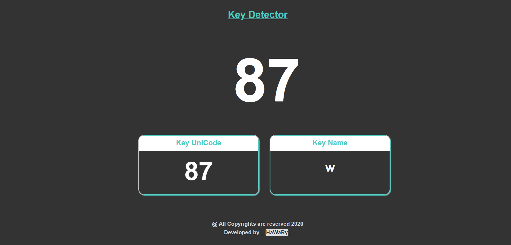

# Key Detector  

Key Detector is an Application that let you discovering the Unicode (ASCII Code) for any Key in the Keyboard.

  
   

## Getting Started

You can try the APP from [here](https://mohamed-elhawary.github.io/key-detector/), just enter any key from your Keyboard directly once the App. is opened and the result will be shown to you.

## Prerequisites

Just Modern Browser like "Chrome" and a Code Editor for Deployment and Develop.

## Built With

* HML5
* CSS3
* JS

## Libraries  

* [jQuery](https://jquery.com/)  

## Features  

* Ability to Copy the Key Unicode, just click on the Unicode Box.  

## Author

* Mohamed Elhawary  

## Contact Me  

* Email: mohamed.k.elhawary@gmail.com

## Deploy with Me

Feel Free to Deploy it with me, send Issues or a Pull Request and i'll deal with you, just test it First.

## License

Licensed under the [MIT License](LICENSE)

